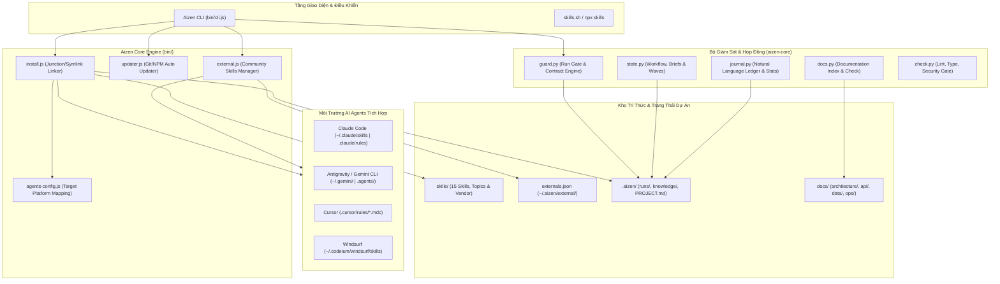
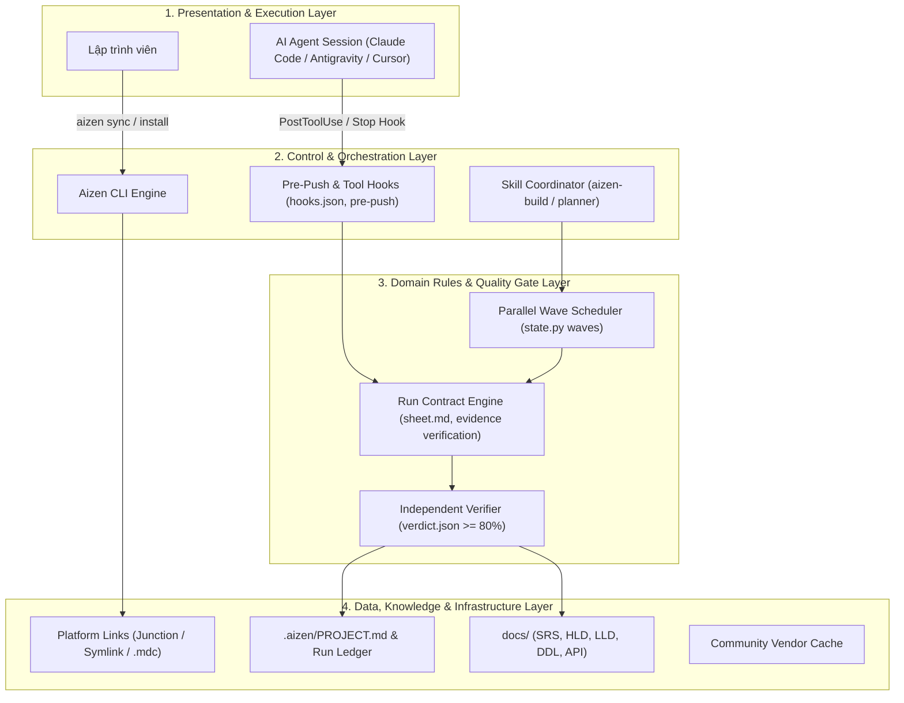
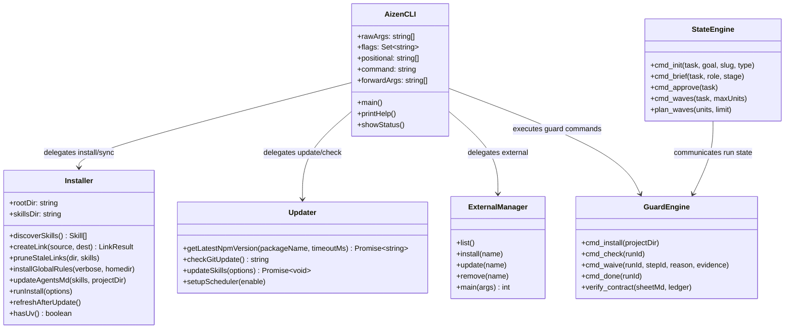
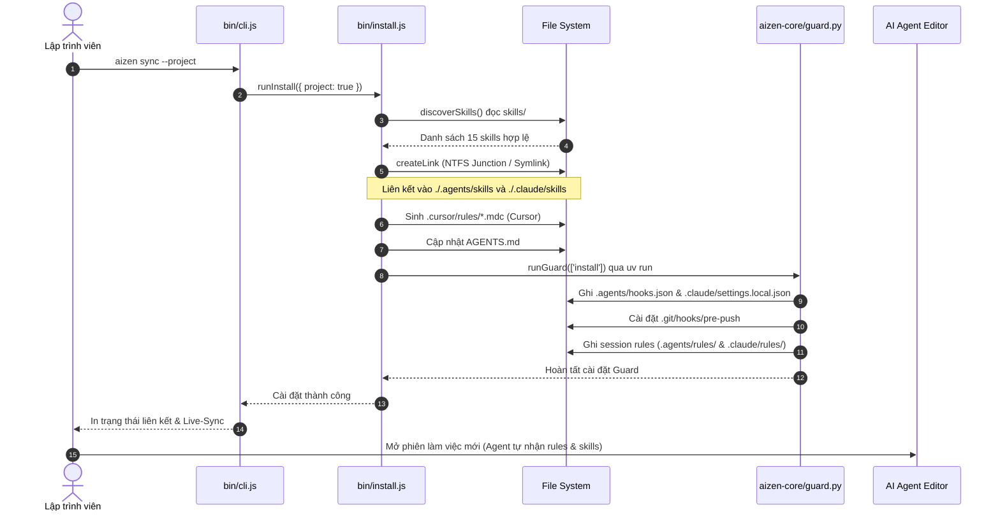
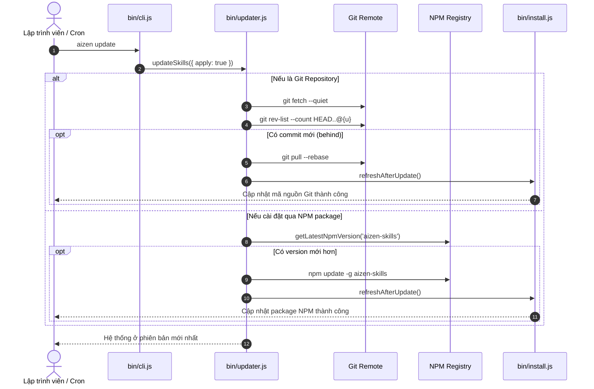
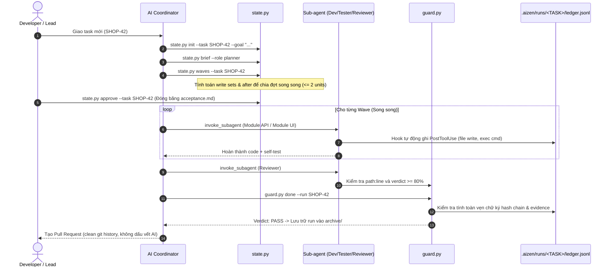
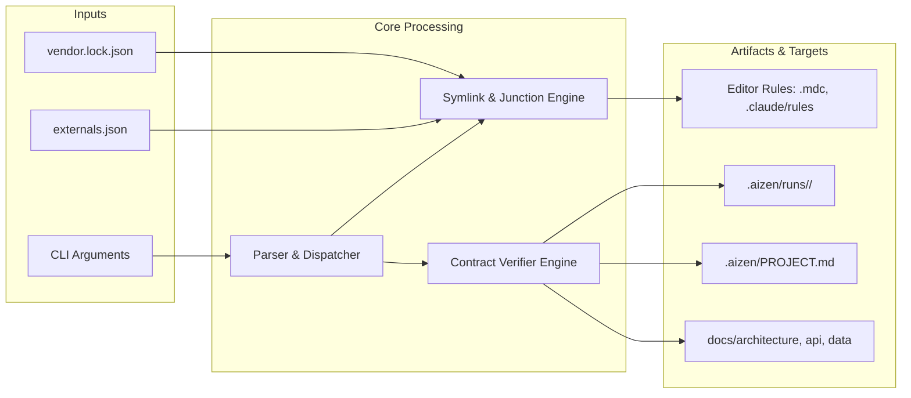
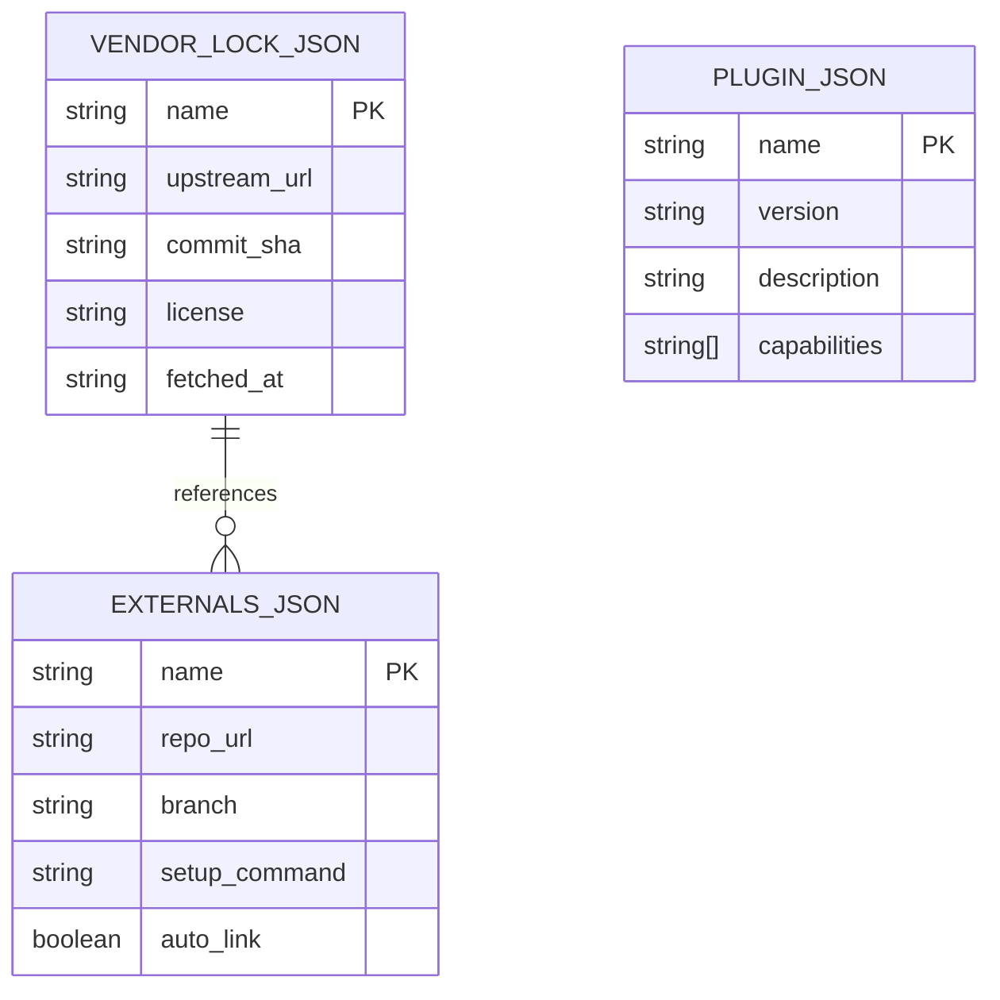
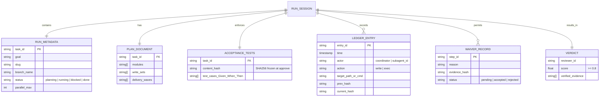

# Tài liệu Kiến trúc Hệ thống Aizen-Skills (Architecture Specifications)

Tài liệu này cung cấp toàn bộ đặc tả kiến trúc, sơ đồ thiết kế chi tiết (HLD, LLD), sơ đồ tuần tự (Sequence Diagrams), sơ đồ luồng dữ liệu (Data Flow Diagrams), cấu trúc trạng thái lưu trữ (Storage/State Schema) và hướng dẫn kết xuất sơ đồ trực quan thông qua công cụ **archify**.

---

## 1. Sơ đồ Kiến trúc Tổng thể Hệ thống (System Architecture Diagram)



---

## 2. Sơ đồ Thiết kế Mức cao (High-Level Design - HLD)



---

## 3. Sơ đồ Thiết kế Mức chi tiết (Low-Level Design - LLD)



---

## 4. Các Sơ đồ Tuần tự về Luồng Hoạt động (Sequence Diagrams)

### 4.1. Luồng Cài đặt & Đồng bộ (`aizen sync / install`)



### 4.2. Luồng Kiểm tra & Cập nhật (`aizen update / check`)



### 4.3. Vòng đời Nhiệm vụ & Kiểm soát Chất lượng (Guard & State Flow)



---

## 5. Sơ đồ Luồng Dữ liệu (Data Flow Diagrams - DFD)

### 5.1. DFD Level 0 (Context Diagram)

```mermaid
flowchart TD
    User([Lập trình viên])
    ExtRepo([Kho Skill Cộng Đồng])
    GitRemote([Git Remote / NPM])
    
    AizenSystem[[HỆ THỐNG AIZEN-SKILLS]]
    
    AIEngine([AI Coding Assistants: Cursor, Claude, Antigravity])
    LocalProject[([Thư Mục Dự Án Cục Bộ])]

    User -->|1. Lệnh CLI sync / update / guard| AizenSystem
    GitRemote -->|2. Mã nguồn & Version cập nhật| AizenSystem
    ExtRepo -->|3. Community Skills| AizenSystem

    AizenSystem -->|4. Symlink / Rules / Manifests| LocalProject
    AizenSystem -->|5. Hooks / Session Rules| AIEngine

    AIEngine -->|6. Ghi chép Ledger & Evidence| LocalProject
    LocalProject -->|7. Bản đồ PROJECT.md & Design Docs| User
```

### 5.2. DFD Level 1 (Engine Data Flow)



---

## 6. Sơ đồ Cấu trúc Dữ liệu & Lưu trữ (Database & State Schema)

### 6.1. Schema Khóa Phiên bản & Cấu hình



### 6.2. Cấu trúc Trạng thái Thực thi Một Nhiệm vụ (`.aizen/runs/<TASK>/`)



---

## 7. Tích hợp Sơ đồ Tương tác với Archify (Archify Rendering Guide)

Theo quy chuẩn thiết kế của Aizen (`skills/aizen-design/references/design/diagrams.md`), các sơ đồ văn bản / Mermaid trong `docs/` là **nguồn sự thật duy nhất (Source of Truth)**. Khi cần kết xuất sang sơ đồ tương tác chuyên nghiệp hoặc ảnh phục vụ báo cáo:

### Cách cài đặt & Kích hoạt Archify
Archify được khai báo trong `externals.json` của Aizen. Bạn có thể cài đặt thông qua:

```bash
# Cách 1: Cài đặt qua Aizen External Manager
node bin/cli.js external install archify
node bin/cli.js sync

# Cách 2: Cài đặt trực tiếp qua skills.sh
npx skills add tt-a1i/archify -a antigravity -y
```

### Quy trình Render Sơ đồ:
1. Agent đọc cấu trúc Mermaid / ASCII từ `docs/architecture/README.md`.
2. Archify xử lý các khối sơ đồ HLD, LLD, Sequence, DFD và kết xuất ra các file đồ họa tương tác tại `.aizen/docs/architecture/diagrams/*.html` (hoặc SVG/PNG).
3. Các file sơ đồ kết xuất được gắn nhãn nghiệm thu `[verified]` làm bằng chứng hoàn thành nhiệm vụ thiết kế kiến trúc.
