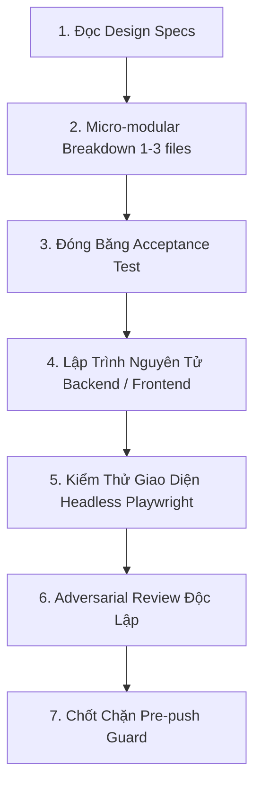

# Chu Trình Lập Trình & Kiểm Thử Siêu Nhỏ (Aizen Code Workflow)

Quy trình `aizen-code` áp dụng triệt để nguyên lý **Micro-modular Execution**: phân rã bài toán lớn thành các lát cắt nguyên tử cực nhỏ để kiểm tra dễ, test nhanh, không chồng chéo mã nguồn và đạt tốc độ thực thi cao nhất.

---

## 1. Giai Đoạn Lập Kế Hoạch Siêu Nhỏ (Micro-modular Breakdown)
* Chuyên gia: `task-planner`.
* **Quy tắc bắt buộc 1–3 Files:**
  - Mỗi micro-module chỉ được phép chạm tối đa từ 1 đến 3 tệp logic liên quan mật thiết (Ví dụ: `user.go`, `user_test.go`, `user_repo.go`).
  - Nếu một tính năng cần sửa 8 files -> bắt buộc phải phân rã thành 3–4 micro-modules riêng biệt.
* **Xếp đợt song song (`state.py waves`):**
  - Các module có write-set không trùng lặp được xếp chạy song song (tối đa 2 units trên một máy để tránh nghẽn tài nguyên).
* **Đóng băng tiêu chuẩn nghiệm thu:**
  - Viết `acceptance.md` với các ca kiểm thử Given/When/Then. Sau khi chủ dự án duyệt (`state.py approve`), file được băm SHA-256 đóng băng.

## 2. Giai Đoạn Lập Trình (Atomic Implementation)
* Chuyên gia: `backend-engineer` & `frontend-engineer`.
* **Backend:** Tuân thủ Clean Architecture của Go, xử lý lỗi tường minh, không bao giờ dùng `panic`.
* **Frontend:** Hiện thực hóa các component theo đúng tỷ lệ và design tokens đã định nghĩa trong Plugin Design (`aizen-design`).

## 3. Giai Đoạn Kiểm Thử Frontend Với Playwright MCP
* Chuyên gia: `frontend-engineer` & `qa-tester`.
* **Tự động hóa kiểm tra giao diện:**
  - Khởi chạy Playwright MCP kết nối trình duyệt headless.
  - Tự động điều hướng đến dev server (`localhost:3000`), thực hiện các thao tác: click, nhập form, kiểm tra responsive.
  - Chụp ảnh màn hình (screenshot) các trạng thái thành công và lỗi, lưu vào `.aizen/runs/<TASK>/evidence/` làm bằng chứng nghiệm thu thực tế.
  - Quét sạch lỗi đỏ trong Console và Network tab trước khi bàn giao.

## 4. Giai Đoạn Phản Biện Độc Lập (Adversarial Review)
* Chuyên gia: `adversarial-reviewer`.
* Reviewer là một phiên làm việc độc lập hoàn toàn với người viết code.
* Mọi nhận xét phải dẫn chứng số dòng cụ thể (`path:line`) có thật trong `git show`.
* Đối chiếu ảnh chụp Playwright với thiết kế ban đầu để đảm bảo giao diện không bị xô lệch layout.
* Chỉ chấp thuận (`verdict: PASS`) khi điểm kiểm định đạt >= 80%.

## 5. Chốt Chặn Trước Khi Push (Pre-push Guard)
* Git hook `.git/hooks/pre-push` kích hoạt:
  - Quét sạch các file AI (`.claude/`, `.agents/`, `AGENTS.md`).
  - Đảm bảo commit message không mang mã run hay trailer AI.
  - Cho phép push lên Git remote sau khi toàn bộ quy trình đạt chuẩn.
