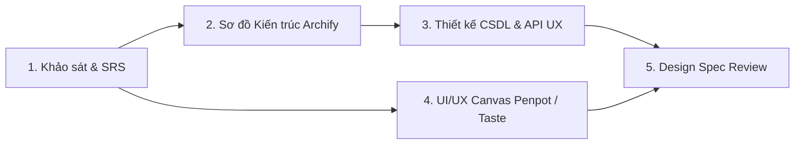

# Chu Trình Thiết Kế Toàn Diện (Aizen Design Workflow)

Quy trình thiết kế của `aizen-design` tách biệt thành hai trục song song nhưng đồng bộ: **Kiến trúc Hệ thống (Archify)** và **Giao diện Canvas (Penpot / Taste skills)**.

---

## 1. Pha Khảo sát & Phân tích Nghiệp vụ (Discovery & SRS)
* Chuyên gia: `system-architect` phối hợp với chủ dự án.
* Sử dụng MCP `sequentialthinking` để bóc tách luồng người dùng và xác định ranh giới bài toán (Scope & Non-scope).
* Kết quả: Lưu vào `docs/product/srs.md` (mỗi mục đều có dòng tóm tắt và Given/When/Then).

## 2. Pha Thiết kế Kiến trúc Trực quan (Architecture via Archify)
* Chuyên gia: `system-architect`.
* Sử dụng `archify` kết hợp Mermaid để tạo các sơ đồ kỹ thuật:
  - Sơ đồ Kiến trúc Tổng thể (System Map).
  - Sơ đồ High-Level Design (HLD) và Low-Level Design (LLD).
  - Sơ đồ tuần tự các luồng chính (Sequence Diagrams).
  - Sơ đồ luồng dữ liệu (Data Flow Diagrams - DFD Level 0/1).
* Kết quả: Lưu bản mô tả tại `docs/architecture/` và render sơ đồ tương tác sang HTML/SVG.

## 3. Pha Thiết kế Giao diện Trực tiếp trên Canvas (UI/UX via Penpot / Taste)
* Chuyên gia: `uiux-designer`.
* Áp dụng bộ quy chuẩn **`taste-skills`**:
  - Hệ thống lưới 4/8pt spacing, typography rõ ràng theo tỷ lệ Modular Scale.
  - Phối màu đạt chuẩn tương phản WCAG AA/AAA.
  - Nguyên tắc Atomic Design (Atoms -> Molecules -> Organisms -> Templates).
* Kết nối trực tiếp với **Penpot MCP Server** (hoặc Figma API):
  - Khởi tạo Artboards, Pages tương ứng với các màn hình trong SRS.
  - Tự động sinh shapes, components, layout và design tokens trực tiếp trên Canvas Penpot.
  - Xuất các asset ảnh/SVG làm tư liệu cho đội Frontend.

## 4. Pha Thiết kế CSDL & API Contracts
* Chuyên gia: `database-architect` & `api-ux-designer`.
* Chuẩn hóa CSDL quan hệ 3NF, mô hình hóa ERD, tạo migration và sinh `docs/data/ddl.sql`.
* Định nghĩa hợp đồng API REST/gRPC theo chuẩn OpenAPI trong `docs/api/<module>.yaml`.

## 5. Nghiệm thu Thiết kế (Design Approval)
* Toàn bộ tài liệu trong `docs/` được kiểm tra qua `docs.py check`.
* Khi chủ dự án duyệt bản thiết kế, các thông số kỹ thuật được chốt để chuyển tiếp sang Plugin `aizen-code`.
