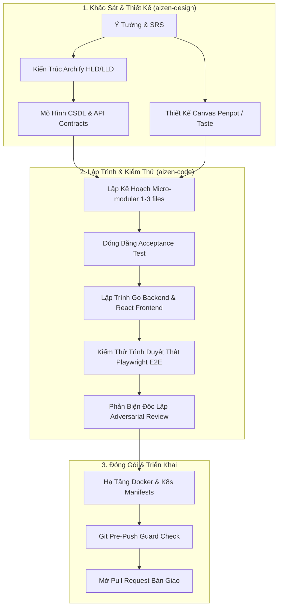

# Chu Trình Phát Triển Toàn Trình Dự Án (Aizen Full Studio Workflow)

Quy trình `aizen-full` điều phối nhịp nhàng giữa **Plugin Design** và **Plugin Code**, đảm bảo sản phẩm hoàn thiện phản ánh 100% bản vẽ kiến trúc và thiết kế giao diện Canvas.

---

## 1. Pha Khởi Tạo & Thiết Kế (Design Stage)
- Điều phối viên kích hoạt các chuyên gia của `aizen-design`:
  - `system-architect` trực quan hóa sơ đồ HLD/LLD bằng `archify`.
  - `uiux-designer` dựng giao diện, components và design tokens trực tiếp trên Canvas `penpot`.
  - `database-architect` hoàn tất file `docs/data/ddl.sql` và bảng mã lỗi API.

## 2. Pha Hiện Thực Hóa Siêu Nhỏ (Micro-modular Coding Stage)
- Điều phối viên chuyển tiếp thông số sang `aizen-code`:
  - `task-planner` chia nhỏ yêu cầu thành các micro-modules (tối đa 1–3 file).
  - Lập trình viên Backend và Frontend xây dựng logic theo ranh giới write-set độc lập.
  - Sử dụng **Playwright MCP** để đối chiếu giao diện chạy thật trên `localhost` với canvas Penpot.
  - Chuyên gia `adversarial-reviewer` phản biện độc lập, yêu cầu dẫn chứng `path:line` cụ thể.

## 3. Pha Nghiệm Thu & Đẩy Mã Nguồn (Delivery Stage)
- Chuyên gia `devops-engineer` hoàn tất kịch bản CI/CD và Dockerfile.
- Chốt chặn `.git/hooks/pre-push` xác nhận toàn bộ bằng chứng kiểm thử đạt chuẩn `PASS` trước khi cho phép đẩy code lên GitHub.
