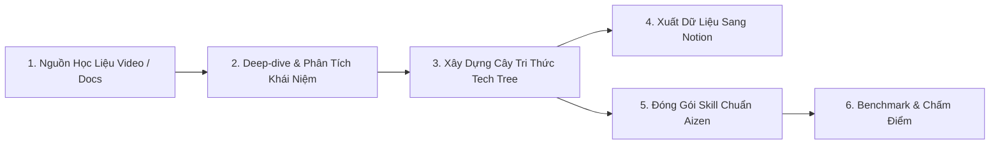

# Chu Trình Nghiên Cứu & Đóng Gói Tri Thức (Aizen Learn Workflow)

Quy trình `aizen-learn` biến các nguồn thông tin rời rạc (tài liệu kỹ thuật, video YouTube, bài viết) thành các bộ kỹ năng tiêu chuẩn hóa có thể tái sử dụng ngay lập tức cho các AI Agent.

---

## 1. Thu Thập & Bóc Tách Học Liệu (Ingestion)
* Chuyên gia: `video-synthesizer` & `tech-researcher`.
* Trích xuất toàn văn transcript từ video YouTube kỹ thuật hoặc cào tài liệu thư viện qua MCP `context7`.
* Sử dụng MCP `sequentialthinking` để loại bỏ các đoạn giới thiệu thừa, trích xuất các mẫu code thực chiến và kiến trúc cốt lõi.

## 2. Xây Dựng Cây Tri Thức (Architecture-first Tech Tree)
* Chuyên gia: `tech-researcher`.
* Phân loại kiến thức theo 4 tầng logic:
  - **Tầng 1 - Core Concepts:** Khái niệm nền tảng không thể thiếu.
  - **Tầng 2 - Architecture:** Cách tổ chức luồng dữ liệu, lifecycle.
  - **Tầng 3 - Practical Implementation:** Cú pháp, best practices, mẫu thiết kế.
  - **Tầng 4 - Pitfalls & Gotchas:** Các lỗi thường gặp và cách né tránh.

## 3. Đồng Bộ Sang Cơ Sở Tri Thức (Notion Integration)
* Chuyên gia: `tech-researcher`.
* Tự động xuất cây tri thức sang cơ sở dữ liệu Notion thông qua script `to_notion.py` để cả nhóm có thể theo dõi và học tập.

## 4. Đóng Gói Kỹ Năng Tiêu Chuẩn (Skill Packaging)
* Chuyên gia: `skill-synthesizer`.
* Chuyển hóa tri thức thành định dạng Aizen Skill chuẩn (`SKILL.md`, `manifest.json`, `references/`, `rules/`).
* Tuân thủ quy chuẩn: Có mô tả kích hoạt rõ ràng, danh sách cấm làm và hướng dẫn từng bước.

## 5. Kiểm Thử Năng Lực & Benchmark (Evaluation)
* Chuyên gia: `benchmark-evaluator`.
* Thiết lập tối thiểu 5 ca kiểm thử thực tế (Eval Cases) để đo lường tỷ lệ trả lời đúng của Agent khi dùng skill mới so với khi không có skill.
* Chỉ chấp thuận đưa vào kho kỹ năng khi điểm số benchmark vượt qua ngưỡng chuẩn (>= 80%).
