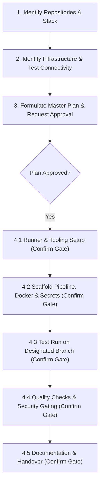

# DevSecOps Pipeline Flow

A rigorous, security-first workflow for agents to design, scaffold, test, and deploy automated DevSecOps pipelines adhering to user habits, container-first principles, and strict human-in-the-loop confirmation gates.

## Ground Rules (Read First)

1. **Ask and Plan First**: Never jump straight into modifying pipelines or installing tools. Establish the scope, formulate a step-by-step plan, and obtain explicit user approval before touching infrastructure.
2. **Container-First with Docker Hub**: Always package services as lightweight, multi-stage container images. Push to Docker Hub using Personal Access Tokens (PAT). Never push using root account passwords.
3. **Absolute Secret Protection**: Secrets (Docker Hub PAT, SSH Private Keys, Kubeconfig, API tokens) must NEVER appear in plaintext logs, commit messages, or pipeline definitions. Always map them to masked CI/CD Secret Stores.
4. **Hard-Gated Execution**: In Stage 4, each step (4.1 through 4.5) is an independent gate. You MUST pause, present the result or proposed action, and receive explicit user confirmation before proceeding to the next step.
5. **Cloudflare Integration**: If Cloudflare MCP or API is available, automatically provide a public Internet entry point using Cloudflare Tunnel (`cloudflared`) or Cloudflare Proxied DNS records.

---

## The 4-Stage Workflow



---

### Stage 1: Identify Repositories and Application Stack

1. Confirm with the user which repositories require DevSecOps integration.
2. Inspect the repository structure, programming language, build system, and existing Dockerfile/configs:
   - Identify runtime requirements (Node.js, Go, Python, Java, Rust, etc.).
   - Check if unit/integration tests exist (`npm test`, `pytest`, `go test`).
   - Determine target branches (e.g. `main` for production, `staging`/`dev` for preview).

---

### Stage 2: Identify Infrastructure and Verify Connectivity

Identify target infrastructure designated by the user:
- **Target A: Linux VPS / Cloud VM (Docker & Docker Compose)**.
- **Target B: Kubernetes Cluster (k8s / k3s / ArgoCD GitOps)**.

Run connectivity validation using the bundled script:
```bash
python scripts/check_connectivity.py --type vps --host <ip> --user <ssh-user> --key <key-path>
# Or for Kubernetes:
python scripts/check_connectivity.py --type k8s --kubeconfig <path-to-kubeconfig>
```

Verify that:
- SSH or Kube API is reachable without timeout.
- Docker daemon is active and user has permission to execute `docker ps`.
- If Cloudflare MCP is connected, query available zones for public domain provisioning.

---

### Stage 3: Formulate Master Plan and Request Confirmation

Draft a comprehensive technical plan containing:
1. **Pipeline Tool**: GitHub Actions, GitLab CI, Jenkinsfile, or ArgoCD GitOps.
2. **Security Tooling Matrix**:
   - Secret Scanning: `Gitleaks` (pre-commit or build stage).
   - SAST (Static Code Analysis): `Semgrep` or `SonarQube`.
   - SCA & Container CVE: `Trivy` (scans base image and built artifact).
3. **Container Registry**: Docker Hub repository name and tagging strategy (`commit-SHA` + branch).
4. **Target Deployment**: Docker Compose service update or Kubernetes manifest rollout.
5. **Domain & SSL**: Cloudflare Tunnel or Proxied DNS.

**HARD GATE**: Present this plan to the user. Do NOT execute any destructive or remote action until the user explicitly says yes.

---

### Stage 4: Five-Step Gated Execution

Each of the following sub-steps requires its own explicit confirmation:

#### 4.1 - Runner and Tooling Preparation
- Review runner requirements: Cloud-hosted runners (default) vs. Self-hosted runner.
- If self-hosted runner or specialized tools (e.g., Docker, Trivy CLI, cloudflared) are needed on the host, present the exact installation commands.
- **GATE**: Ask permission before installing anything on the host. Wait for user confirmation.

#### 4.2 - Scaffold Pipeline, Dockerfile, and Secrets
- Generate production-grade, multi-stage `Dockerfile` following `references/dockerhub-guidelines.md`.
- Generate CI/CD workflow file using helper:
  ```bash
  python scripts/scaffold_pipeline.py --engine github-actions --app <app-type> --dockerhub <repo>
  ```
- Identify mandatory secrets using `scripts/secret_helper.py`:
  * `DOCKERHUB_USERNAME` and `DOCKERHUB_TOKEN` (Personal Access Token).
  * `SSH_HOST`, `SSH_USER`, `SSH_PRIVATE_KEY` (for VPS) or `KUBECONFIG` (for K8s).
- Guide user to set secrets in repository settings (never send raw secret values in chat).
- If Cloudflare MCP is connected, configure Tunnel or DNS via `references/cloudflare-guide.md`.
- **GATE**: Show the complete generated files and secrets checklist to the user for review and approval.

#### 4.3 - Test Run on Designated Branch
- Commit pipeline files to a feature/staging branch (e.g. `feature/devsecops-pipeline`).
- Trigger the CI/CD pipeline run:
  * Stage 1: Checkout & Gitleaks secret scan.
  * Stage 2: Semgrep/SonarQube SAST analysis.
  * Stage 3: Docker Build & Trivy image vulnerability scan.
  * Stage 4: Docker Hub push (`<repo>:<sha>` and `<repo>:<branch>`).
  * Stage 5: CD Deploy to VPS or K8s sync.
- Monitor execution logs and track stage status in real-time.
- **GATE**: Present the pipeline run status and execution URL to the user.

#### 4.4 - Quality Check & Security Gate Evaluation
- Inspect logs against security thresholds defined in `references/security-gates.md`:
  * Ensure Gitleaks found zero leaked credentials.
  * Ensure Trivy has zero `CRITICAL` unpatched vulnerabilities.
  * Ensure application containers are healthy (`docker compose ps` or `kubectl rollout status`).
  * Check HTTP response from the public Cloudflare domain.
- If any security check fails, analyze failure cause and provide remediations.
- **GATE**: Present security scan summary report and verify user accepts quality results.

#### 4.5 - Documentation & Handover
Generate standard Markdown documentation in the project repository following `references/handover-template.md`:
- `docs/INFRA_DOCS.md`: Server topology, ports, runner configs, Cloudflare routing.
- `docs/ENV_VARS.md`: Required secrets, environment variables, token scopes, rotation policy.
- `docs/PROCEDURES.md`: Rollback procedure, emergency stop, deployment workflow runbook.
- **GATE**: Deliver documentation and request final user sign-off.

---

## Bundled Resources

- `scripts/check_connectivity.py`: Validates SSH, Docker daemon, K8s, and Cloudflare credentials.
- `scripts/secret_helper.py`: Verifies secret definitions, masks sensitive tokens, and checks Docker Hub PAT format.
- `scripts/scaffold_pipeline.py`: Generates boilerplate pipelines for GitHub Actions, GitLab CI, Jenkins, and ArgoCD.
- `references/security-gates.md`: Severity cutoffs and configurations for Trivy, Gitleaks, and Semgrep.
- `references/cloudflare-guide.md`: Configuration patterns for Cloudflare Tunnel (`cloudflared`) and DNS Proxies.
- `references/dockerhub-guidelines.md`: Multi-stage Dockerfile patterns, immutable tagging, and PAT management.
- `references/handover-template.md`: Standard templates for infrastructure, env vars, and operational runbooks.
